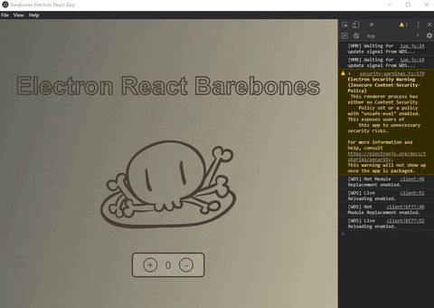

# Electron React Barebones

A stripped down version of [react-boiler-plate](https://github.com/electron-react-boilerplate/electron-react-boilerplate)



# What's included?
```
react 16.13 & react-hot-reloading
  devtools
electron 8.20
  builder
  updater
  debug
  log
  devtools
webpack & basic loaders and plugins
yarn
```

# What's not included?

```
redux
jest
sass
eslint or lint
react-router
```

# Before Installing

Most of the webpack configuration was not done by me but by the folks of [react-boiler-plate.](https://github.com/electron-react-boilerplate/electron-react-boilerplate) Any credits go to them.

I stripped this down with almost no webpack knowledge, essentially learning as I went.

So if you're intending to use this for production I highly recommend you to use [react-boiler-plate](https://github.com/electron-react-boilerplate/electron-react-boilerplate)

There might be some lingering packages and webpack configurations left over, if you find any please submit an issue.


# How to install?

**This boilerplate works with `npm` or `yarn` but uses `yarn` internally**

```
git clone --depth 1 --single-branch --branch master https://github.com/rodpadev/create-electron-react-barebones.git your-project-name
cd your-project-name
npm install
```

# How to run?

```
yarn dev -- App in development mode with [HMR]
npm start -- App in production mode no [HMR]
```
# How to pack?

This uses electron-builder, for more information on how to configure [visit the docs.](https://www.electron.build/)

```
npm run package -- Package app for local platform
```

# Want to help me?

If you see a bug or any unecessary line of code feel free to raise an issue or a PR. 